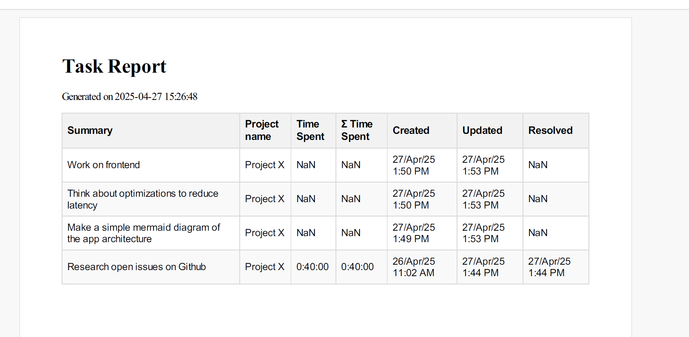

# Export Jira tasks and generate PDF report

## Usage

Fill `.env` with your values:

```
JIRA_URL=https://yoursite.atlassian.net/
EMAIL=youremail@email.com
API_TOKEN="<your api token https://id.atlassian.com/manage-profile/security/api-tokens>"
PROJECT_KEY=AB # TWO LETTER PROJECT KEY NORMALLY
HOURLY_RATE=250 # YOUR HOURLY RATE IN YOUR CURRENCY
CURRENCY=$ # YOUR CURRENCY SYMBOL
```

Export CSV tasks from Jira and run the following program

```
uv run main.py
```

Terminal alias command:

```
alias treport='cd ~/projects/jira-export-tasks/ && uv run main.py'
```

And just run `treport [date_optional_iso_format like this 2025-05-18T21:42:00]`

## Result

**report.pdf**


